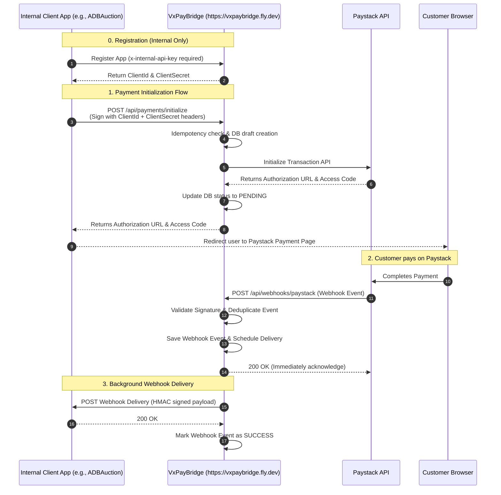

# VxPayBridge — Payment Integration & State Orchestration

VxPayBridge is a stateful orchestrator and payment gateway bridge designed to interface securely between Variable X Solutions internal applications (e.g. `ADBAuction`, Inventory Management) and **Paystack**. It ensures secure, transaction-safe, and idempotent payment processing without exposing core credentials or Paystack logic to frontend or multiple distinct backend systems.

## Base URL
All production endpoints are hosted at:
`https://vxpaybridge.fly.dev`

---

## High-Level Architecture



---

## 🔒 Authentication Security

VxPayBridge uses two tiers of authentication:

1. **Internal Admin Endpoints** (`/api/internal/*`)
   * Protected by a master API key.
   * Header required: `x-internal-api-key: <your_master_key>`

2. **Client Endpoints** (`/api/payments/*`)
   * Protected by application-specific credentials generated during client registration.
   * Headers required:
     * `x-client-id: <client_id>`
     * `x-client-secret: <client_secret>`

---

## 🚀 API Endpoint Documentation

### 1. Register Client Application (Internal Admin Only)
Registers a new internal application (like `ADBAuction`) and provides client credentials.

* **Endpoint**: `POST /api/internal/clients`
* **Headers**:
  * `x-internal-api-key`: `vx_api_key_8b99d52a220b4ea78e47f2e1a384e912`
* **Request Payload**:
  ```json
  {
    "code": "ADBAuction",
    "name": "ADB Auction Portal",
    "webhookUrl": "https://www.vxauction.store/api/payments/webhook"
  }
  ```
* **Response Payload (200 OK)**:
  ```json
  {
    "clientId": "client_8b99d52a220b4ea78e47f2e1a384e912",
    "clientSecret": "sec_8e72ba6f3162a8c3d98fb69a7c36a4b1..."
  }
  ```
  > [!WARNING]
  > The `clientSecret` is hashed in the database and is **only returned once** during this creation step. Store it securely.

---

### 2. Initialize Payment
Initiates a new transaction with Paystack and returns the checkout URL.

* **Endpoint**: `POST /api/payments/initialize`
* **Headers**:
  * `x-client-id`: `<your_client_id>`
  * `x-client-secret`: `<your_client_secret>`
* **Request Payload**:
  ```json
  {
    "amount": 250.00,
    "currency": "GHS",
    "clientReference": "auction-sale-9843",
    "clientEmail": "customer@example.com",
    "callbackUrl": "https://www.vxauction.store/payment/callback"
  }
  ```
* **Response Payload (200 OK)**:
  ```json
  {
    "authorizationUrl": "https://checkout.paystack.com/qy812a...",
    "accessCode": "qy812a...",
    "reference": "TRX-7b9954ab727ed1079516470b820ece66"
  }
  ```

#### 🛡️ Idempotency Guarantee
* The `clientReference` combined with the calling application identity acts as a unique idempotency key.
* If a payment initialization request is repeated with the **same** `clientReference` while the previous transaction is still `PENDING`, VxPayBridge will bypass calling Paystack again and instantly return the existing `authorizationUrl` and `accessCode`.
* If the transaction has already succeeded or failed, the system blocks the request to prevent double-charges.

---

### 3. Check Payment Status
Allows client applications to pull the current status of a payment transaction at any time.

* **Endpoint**: `GET /api/payments/status/{clientReference}`
* **Headers**:
  * `x-client-id`: `<your_client_id>`
  * `x-client-secret`: `<your_client_secret>`
* **Response Payload (200 OK)**:
  ```json
  {
    "id": "7b9954ab-727e-d107-9516-470b820ece66",
    "clientReference": "auction-sale-9843",
    "gatewayTransactionId": "TRX-7b9954ab727ed1079516470b820ece66",
    "amount": 250.00,
    "currency": "GHS",
    "status": "SUCCESS",
    "createdAt": "2026-06-10T17:39:31Z",
    "updatedAt": "2026-06-10T17:39:32Z"
  }
  ```
  > Valid Status values: `INITIALIZING`, `PENDING`, `SUCCESS`, `FAILED`.

---

### 4. Paystack Webhook Handler (Public)
Public-facing endpoint target configured in your Paystack dashboard to receive real-time webhook updates.

* **Endpoint**: `POST /api/webhooks/paystack`
* **Webhook Target URL**: `https://vxpaybridge.fly.dev/api/webhooks/paystack`
* **Payload signature verification**: Verified using the `x-paystack-signature` header against the system's `Paystack:SecretKey`.
* **Webhook Deduplication**: Webhooks are uniquely deduplicated using the combination of `gateway_transaction_id` + `event` to ensure that duplicate webhook calls from Paystack do not trigger duplicate handlers or deliveries.

---

## ⚡ Reliable Webhook Delivery

To guarantee that your client application is notified of payment events even during network interruptions:
1. When a webhook is verified, VxPayBridge saves the event and immediately returns a `200 OK` to Paystack.
2. An asynchronous background worker is scheduled to forward the webhook payload to the client app's registered `webhookUrl`.
3. The delivery payload sent to the client application is signed using an HMAC SHA-256 signature passed in the `x-payload-signature` header.
4. **Automatic Retries**: If your application is down or returns a non-2xx status code, the bridge will automatically retry delivering the notification with exponential backoff.

### Webhook Signature Verification in Client Apps
When your application receives a webhook delivery from VxPayBridge, you should verify the signature to ensure it came from the bridge:
1. Compute the HMAC SHA-256 signature of the raw request body bytes using your application's `clientSecret` as the key.
2. Convert the computed hash to a hexadecimal string.
3. Compare the computed hash with the signature provided in the `x-payload-signature` header (using a constant-time comparison).

#### Code Examples

##### C# (.NET)
```csharp
using System.Security.Cryptography;
using System.Text;

public static bool VerifySignature(string rawRequestBody, string clientSecret, string receivedSignature)
{
    using var hmac = new HMACSHA256(Encoding.UTF8.GetBytes(clientSecret));
    var computedBytes = hmac.ComputeHash(Encoding.UTF8.GetBytes(rawRequestBody));
    var computedSignature = Convert.ToHexString(computedBytes).ToLowerInvariant();
    
    // Constant-time comparison to prevent timing attacks
    return CryptographicOperations.FixedTimeEquals(
        Encoding.UTF8.GetBytes(computedSignature), 
        Encoding.UTF8.GetBytes(receivedSignature.ToLowerInvariant())
    );
}
```

##### Node.js
```javascript
const crypto = require('crypto');

function verifySignature(rawRequestBody, clientSecret, receivedSignature) {
    const computedSignature = crypto
        .createHmac('sha256', clientSecret)
        .update(rawRequestBody)
        .digest('hex');
        
    return crypto.timingSafeEqual(
        Buffer.from(computedSignature, 'utf-8'),
        Buffer.from(receivedSignature, 'utf-8')
    );
}
```
